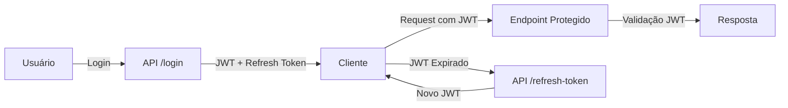

# 📦 Inventory Manager API

Uma API REST para **gerenciamento de estoque e vendas**, construída com **TypeScript**, **Node.js**, **Express**, **PostgreSQL (15+)** e **TypeORM**.  
Desenvolvida seguindo os princípios do **SOLID**, utilizando **Clean Architecture** e **DDD (Domain-Driven Design)**.

---

## 🚀 Tecnologias Utilizadas

- **Node.js** – Ambiente de execução JavaScript no servidor
- **TypeScript** – Superset do JavaScript com tipagem estática
- **Express** – Framework web minimalista e rápido
- **PostgreSQL** – Banco de dados relacional (v15 ou superior)
- **TypeORM** – ORM para integração com o banco
- **JWT** – Autenticação segura via tokens
- **Refresh Token** – Persistência de sessão de forma segura
- **Docker & Docker Compose** – Containerização e orquestração

---

## 📋 Funcionalidades

- 👤 **Cadastro de usuário**
- 🔒 **Controle de acesso baseado em cargo** (RBAC)
- 🔑 **Autenticação com JWT** e **persistência com refresh token**
- 🏷 **Cadastro de categorias**
- 📦 **Cadastro de produtos**
- ➕ **Adicionar produtos ao estoque**
- ➖ **Remover produtos do estoque**
- 💰 **Lançamento de vendas**
- 📊 **Geração de relatórios de vendas**

---

## 📂 Estrutura do Projeto (EAP)

```
src/
├── core/               # Casos de uso, contratos e lógica de aplicação
├── domain/             # Entidades e regras de negócio
├── infrastructure/     # Banco de dados, TypeORM, rotas, middlewares e serviços externos
├── main/               # Configurações de inicialização
├── shared/             # Utilitários e módulos comuns
```

---

## 🛠 Instalação e Configuração

### 1️⃣ Pré-requisitos
- **Docker** >= 24
- **Docker Compose** >= 2.0

### 2️⃣ Configurar variáveis de ambiente
Crie um arquivo `.env` na raiz do projeto:

```env
# DB CONFIG
DB_HOST=
DB_PORT=
DB_USER=
DB_PASSWORD=
DB_NAME=

# DATABASE URL
DATABASE_URL=

# ENVIRONMENT
NODE_ENV=

# PORTS
PORT=

# AUTH
JWT_SECRET=
REFRESH_TOKEN_SECRET=
EXPIRES_REFRESH_TOKEN_DAYS=
```

> **Observação:** No Docker, o `DB_HOST` deve ser o nome do serviço do banco definido no `docker-compose.yml` (ex.: `db`).

---

## ▶️ Rodando com Docker Compose

```bash
docker-compose up -d
```

Isso irá:
- Criar e iniciar um container para a API
- Criar e iniciar um container para o PostgreSQL
- Criar um volume para persistência dos dados do banco

---

## 🔄 Executando migrations dentro do container

Após subir os containers, execute:

```bash
docker-compose exec api npm run typeorm migration:run
```

---

## 📥 Parando e removendo containers

```bash
docker-compose down
```

Se quiser remover volumes e dados do banco:
```bash
docker-compose down -v
```

---

## 🔑 Fluxo de Autenticação


---

## 📌 Rotas Principais

| Método | Endpoint           | Descrição                    | Autenticação |
|--------|-------------------|-------------------------------|--------------|
| POST   | `/users`          | Criar usuário                 | ❌          
| POST   | `/session`        | Autenticar usuário            | ❌           
| GET    | `/users/profile`  | Obter perfil                  | ✅           
| POST   | `/categories`     | Criar categoria               | ✅(Admin)
| GET    | `/categories`     | Listar categorias             | ✅       
| POST   | `/products`       | Criar produto                 | ✅(Admin)   
| POST   | `/stock/add`      | Adicionar ao estoque          | ✅           
| POST   | `/stock/remove`   | Remover do estoque            | ✅(Admin)         
| POST   | `/sales`          | Registrar venda               | ✅
| GET    | `/reports/sales`  | Relatório de vendas           | ✅(Admin)        

---

## 🧪 Testes

Este projeto utiliza **Vitest** para testes unitários.

Para rodar os testes:
```bash
npm run test
```

Para rodar os testes em modo watch:
```bash
npm run test:watch
```

Para gerar o coverage:
```bash
npm run test:coverage
```

---

## 📄 Licença

Este projeto está sob a licença MIT.  
